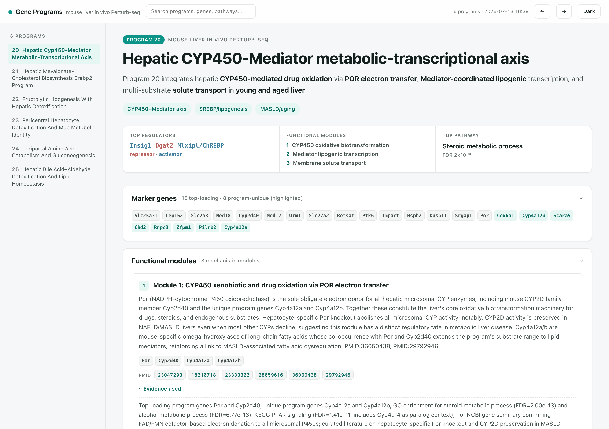
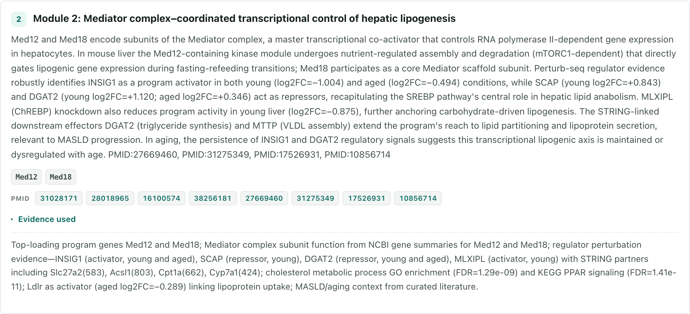
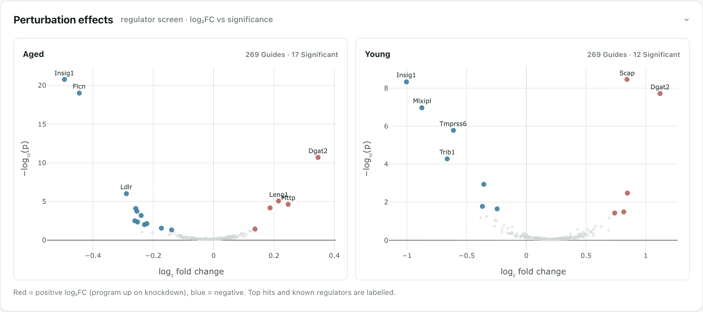

# Gene Program Interpreter (GPI)

<p align="center">
  
</p>

**Turn weighted gene programs into a biological story where every claim links to a real paper.**

GPI interprets programs from cNMF, NMF, single-cell, or Perturb-seq data. It runs parallel
Claude literature research, verifies every PMID/DOI, and produces an interactive HTML
report. Citations that fail verification are marked unsupported rather than presented as
evidence.

The biology is tissue-agnostic: organism, tissue, cell type, and conditions live in a small
context profile instead of in the code.

**[Pipeline walkthrough →](https://ifanirene.github.io/gene-program-interpreter/)** — a
stage-by-stage tour of how a gene program becomes a cited report.

> **GPI is a Claude Code plugin.** Claude checks your data, builds the biological context,
> previews the cost, runs the pipeline, and walks you through the report. The skill is the
> user interface; the Python pipeline is the engine — this is not a choice between them.
> A [standalone CLI](#standalone-cli) is available for scripted workflows.

**Contents** — [What you get](#what-you-get) · [What you provide](#what-you-provide) ·
[Install](#install) · [Use it in Claude](#use-it-in-claude) · [Cost and safety](#cost-and-safety) ·
[Standalone CLI](#standalone-cli) · [How it works](#how-it-works)

## What you get

A self-contained `report.html`. Each program gets a plain-language title, marker genes,
mechanistic modules, enriched pathways, regulators, and linked evidence.

**[Explore the live Brain EC demo report →](https://ifanirene.github.io/gene-program-interpreter/brain_ec_demo/report.html)** —
a real three-program analysis with interactive pathway, regulator, and citation views. The
report source and its enrichment figures are also included in
[`examples/brain_endothelial_demo/`](examples/brain_endothelial_demo).



Every mechanistic claim lists its genes and verified PMIDs/DOIs, alongside the deterministic
evidence used to support the interpretation.



If you provide Perturb-seq regulator effects, the report also shows which perturbations move
each program, including condition-specific comparisons.



## What you provide

The minimum input is one gene-loading CSV with one row per gene per program:

```csv
Name,Score,RowID
Npepps,0.00165,1
Myo9a,0.00159,1
Nfat5,0.00149,1
```

Common column names are detected automatically — the `RowID` above is recognised as the
program column, so you rarely need to rename anything:

| Required value | Accepted examples |
|---|---|
| gene name | `Name`, `Gene`, `Symbol`, `gene_name`, `gene_symbol` |
| loading | `Score`, `Loading`, `Weight`, `Value`, `gene_score` |
| program | `program_id`, `RowID`, `topic`, `factor`, `component` |

Optional inputs add Perturb-seq regulator effects (`program_id, target_gene, log2_fc,
significant`) or cell-type enrichment (`cell_type, program, log2_fc`, plus `direction` and/or
`fdr`). Claude validates every column before anything is spent.

Cell-type enrichment is worth supplying: its signed log2FC values reach the annotation model
directly, and they are what let it distinguish a **cell-type identity** program from a
**cross-cell-type functional** one. Strong depletion in a lineage is as informative as
enrichment.

### Demo dataset

[`examples/brain_endothelial_demo/`](examples/brain_endothelial_demo) ships a real dataset you
can run end to end: a mouse brain endothelial Perturb-seq screen (cNMF, k=100) from postnatal
brain, targeting 166 vascular signalling regulators.

| File | Role |
|---|---|
| `FB_moi15_seq2_loading_gene_k100_top300.csv` | gene loadings — 100 programs × 300 genes |
| `Discovery_FP_moi15_seq2_thresh10_k100_default.csv` | regulator effects — 16,200 tested pairs |
| `FP_moi15_seq2_cnmf_program_markers_celltype_l2_top10_enriched_depleted.csv` | cell-type enrichment — signed log2FC per lineage |

[`configs/example_generic.yaml`](configs/example_generic.yaml) is a runnable config for this
dataset, wiring up all three files and scoped to three programs (9, 48, 70) with contrasting
cell-type signals.

## Install

### 1. Prerequisites

- [Claude Code](https://docs.claude.com/en/docs/claude-code/overview), signed in to the
  Claude account you want the research to run under
- [`uv`](https://docs.astral.sh/uv/getting-started/installation/), which provides the
  isolated Python runtime:

  ```bash
  curl -LsSf https://astral.sh/uv/install.sh | sh
  ```

### 2. Install the plugin

```bash
claude plugin marketplace add ifanirene/gene-program-interpreter
claude plugin install gene-program-interpreter@gpi
```

Restart Claude Code, or run `/reload-plugins`. The first use builds the isolated Python
environment; later runs reuse it.

### 3. Configure credentials

Create a `.env` file in the directory where you will run the analysis (see
[`.env.example`](.env.example)):

```dotenv
ANTHROPIC_API_KEY=...          # Anthropic Batch: themes, annotation, presentation
PUBMED_EMAIL=you@example.com   # required courtesy contact for NCBI/Crossref
OPENALEX_API_KEY=...           # recommended; full OpenAlex verification coverage
NCBI_API_KEY=...               # recommended; higher PubMed rate limit
```

Authentication is intentionally split:

- Parallel literature agents use your **Claude login/subscription**.
- Batch synthesis uses **`ANTHROPIC_API_KEY`**.

No external MCP server is required — PubMed, OpenAlex, and Crossref tools run inside the
pipeline. The same `.env` serves the standalone CLI.

## Use it in Claude

Start Claude Code in the directory containing your data, then invoke the skill:

```text
/gene-program-interpreter:interpret path/to/gene_loading.csv
```

Or just ask, and the skill triggers on its own:

```text
Interpret these cNMF programs in mouse brain endothelial cells:
examples/brain_endothelial_demo/FB_moi15_seq2_loading_gene_k100_top300.csv
```

Claude then:

1. checks the installation and validates your input columns;
2. proposes the biological context — organism, tissue, cell type, conditions — for you to
   review and correct;
3. shows a dry-run plan and cost scope;
4. **asks for your approval before starting any paid work**;
5. monitors the run and opens the cited HTML report with you.

The context terms in step 2 are the highest-leverage control you have over research quality.
Use 6–10 phrases describing the cell type's *normal* biology, and keep disease or
perturbation emphasis in `conditions`.

For a first run, start with 3–5 representative programs — research cost scales with program
count.

## Cost and safety

- Input validation, dry runs, and installation checks make **no paid API calls**.
- Claude asks for explicit approval before starting paid work.
- Literature research has a configurable budget and concurrency limit. `max_budget_usd` is a
  cap **per program**, not per run — the worst case for a run is `max_budget_usd × len(programs)`.
- Runs cache completed steps in `pipeline_state.json`, so a network failure is resumable
  rather than repaid.
- A failed research step degrades gracefully: the report still renders, with the affected
  literature marked incomplete.

## Standalone CLI

Everything above runs through Claude. Use the CLI directly if you want a scriptable workflow
outside Claude Code. It reads the same [`.env`](#3-configure-credentials).

**Install:**

```bash
uv tool install "gene-program-interpreter[progress] @ git+https://github.com/ifanirene/gene-program-interpreter.git"
gpi doctor    # read-only check of login and configuration
```

**Try the demo.** [`configs/example_generic.yaml`](configs/example_generic.yaml) runs the
[demo dataset](#demo-dataset) as-is. Validating and previewing spend nothing:

```bash
gpi --check-inputs --config configs/example_generic.yaml   # validate columns
gpi --config configs/example_generic.yaml --dry-run        # preview plan and scope
gpi --config configs/example_generic.yaml                  # full pipeline (paid)
```

**Author a config for your own data.** Copy `configs/example_generic.yaml` and change:

- `inputs.gene_loading` — required weighted gene-program CSV;
- `inputs.regulators` or `inputs.regulators_by_condition` — optional Perturb-seq effects;
- `context` — organism, tissue, cell type, conditions, and normal cell functions;
- `output_dir`, and an optional `programs` subset.

Or let the CLI assemble one from a context stub and your input paths:

```bash
gpi --emit-config --context-file context.yaml \
    --gene-loading genes.csv --output-dir runs/my_run -o runs/my_run.yaml
```

Scope a first pass with the config's `programs:` key, or with `--programs 9,48,70` when
emitting one. Useful flags for the run itself: `--no-research` (deterministic enrichment
only, no spend) and `--progress plain`.

Outputs land in the config's `output_dir`. Interrupted runs resume from
`pipeline_state.json`; `--start-from`, `--stop-after`, and `--force-restart` control where a
rerun picks up. Run `gpi --help` for the full flag list.

## How it works

| Layer | Role |
|---|---|
| Claude skill | Collects inputs, builds context, previews cost, launches and monitors |
| Python pipeline | Runs deterministic processing, caching, verification, and reporting |
| Claude Agent SDK | Runs one isolated literature-research session per program |
| Anthropic Batch | Synthesizes themes, labels, and presentation text |

```text
.claude-plugin/   plugin and marketplace manifests
skills/           distributable Claude skill
bin/gpi           plugin runtime wrapper
gpi/              deterministic pipeline and Anthropic Batch steps
research/         parallel research agents, protocol, and citation verification
configs/          example run configurations
tests/            offline regression tests and fixtures
```

The [pipeline walkthrough](https://ifanirene.github.io/gene-program-interpreter/) illustrates
these six stages end to end. See [`docs/ARCHITECTURE.md`](docs/ARCHITECTURE.md) for data
contracts and the complete module map.

## Development

```bash
git clone https://github.com/ifanirene/gene-program-interpreter.git
cd gene-program-interpreter
uv sync --extra dev --extra progress
uv run pytest
```

`pip install -e .` still works for contributors, but it is not the recommended user
installation.

## License

Gene Program Interpreter is open-source software under the OSI-approved
[Apache License 2.0](LICENSE).
