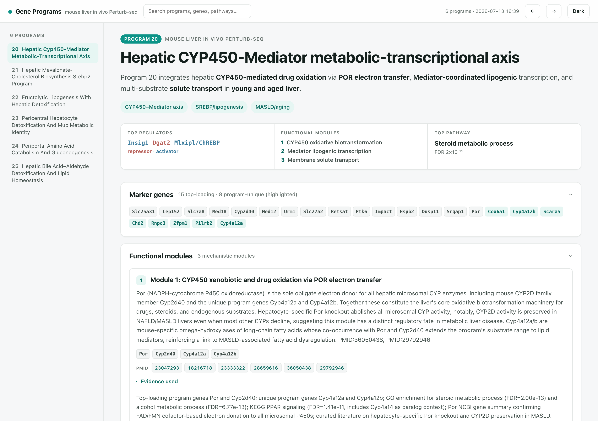
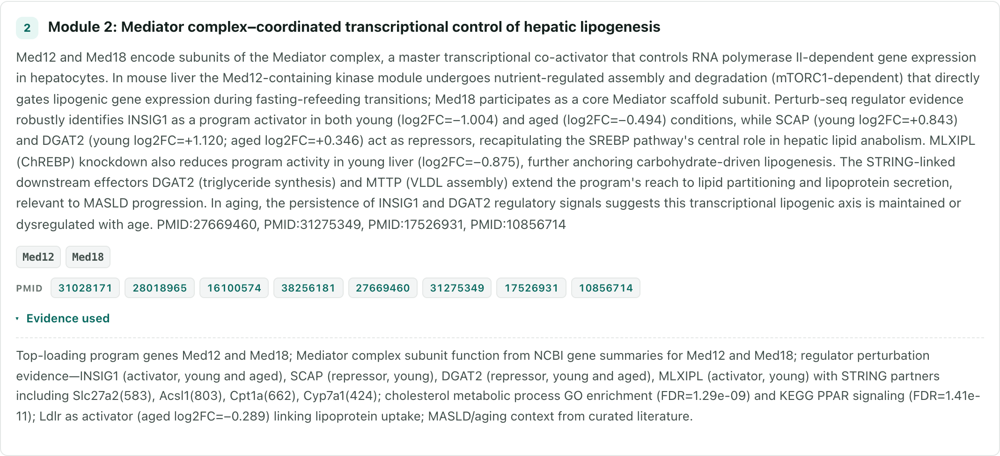
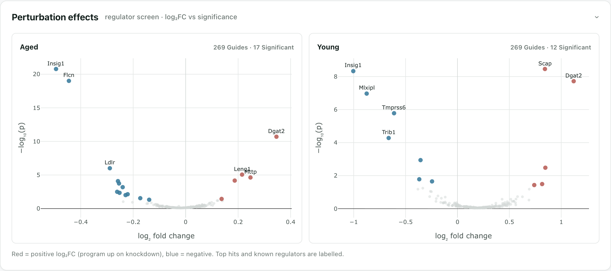
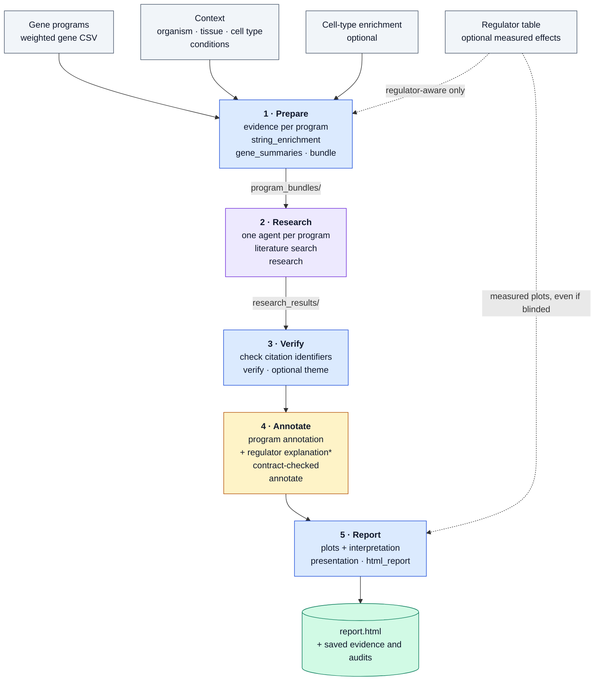

<h1 align="center">Gene Program Interpreter (GPI)</h1>

<p align="center">
  
</p>

<p align="center">
  <strong>Turn weighted gene programs into biological interpretations with traceable literature evidence.</strong>
</p>

<p align="center">
  <a href="https://www.youtube.com/watch?v=51G7lQjjJHc"><strong>▶ Watch the demo</strong></a>
  &nbsp;·&nbsp;
  <a href="https://ifanirene.github.io/gene-program-interpreter/brain_ec_demo/report.html"><strong>Explore a live report</strong></a>
  &nbsp;·&nbsp;
  <a href="https://ifanirene.github.io/gene-program-interpreter/"><strong>View the pipeline</strong></a>
</p>

GPI interprets gene programs from cNMF, NMF, single-cell, or Perturb-seq data. It runs
parallel Claude literature research, checks every PMID/DOI, and produces an interactive HTML
report; unresolved citations stay labeled. A verified identifier shows that a paper exists,
not that it supports the claim — that still requires reading the evidence. Organism, tissue,
cell type, and conditions live in a small context profile, so the biology is tissue-agnostic.

> **GPI is a Claude Code plugin.** Claude checks your data, builds the biological context,
> previews the cost, runs the pipeline, and walks you through the report. A
> [standalone CLI](#standalone-cli) is available for scripted workflows.

## What you get

A self-contained `report.html`. Each program gets a plain-language title, marker genes,
mechanistic modules, enriched pathways, regulators, and linked evidence.

<p align="center">
  <a href="https://ifanirene.github.io/gene-program-interpreter/brain_ec_demo/report.html">
    
  </a>
</p>

<table>
  <tr>
    <td width="50%" valign="top">
      <br>
      <strong>Auditable evidence</strong><br>
      <sub>Every mechanistic claim links its genes, verified PMIDs/DOIs, and deterministic evidence.</sub>
    </td>
    <td width="50%" valign="top">
      <br>
      <strong>Perturbation effects</strong><br>
      <sub>See which regulators move each program, including condition-specific comparisons.</sub>
    </td>
  </tr>
</table>

## What you provide

The minimum input is one gene-loading CSV — your **gene programs** — with one row per gene
per program. Common column names are detected automatically:

```csv
Name,Score,RowID
Npepps,0.00165,1
Myo9a,0.00159,1
```

| Required value | Accepted examples |
|---|---|
| gene name | `Name`, `Gene`, `Symbol`, `gene_name`, `gene_symbol` |
| loading | `Score`, `Loading`, `Weight`, `Value`, `gene_score` |
| program | `program_id`, `RowID`, `topic`, `factor`, `component` |

Two inputs are optional: a **regulator table** of measured Perturb-seq effects, and a
**cell-type enrichment** table that helps separate cell-type identity programs from
cross-cell-type functional ones ([formats](docs/GUIDE.md#inputs)). Claude validates every
column before anything is spent.

**Demo data.** [`examples/brain_endothelial_demo/`](examples/brain_endothelial_demo) is a
mouse brain endothelial Perturb-seq screen (cNMF, k=100) with all three inputs, and
[`configs/example_generic.yaml`](configs/example_generic.yaml) runs it on three programs
([file details](docs/GUIDE.md#demo-dataset)).

## Install

### 1. Prerequisites

- [Claude Code](https://docs.claude.com/en/docs/claude-code/overview), signed in to the
  Claude account you want the research to run under
- [`uv`](https://docs.astral.sh/uv/getting-started/installation/), which provides the
  isolated Python runtime:

  ```bash
  curl -LsSf https://astral.sh/uv/install.sh | sh
  ```

### 2. Install the plugin

```bash
claude plugin marketplace add ifanirene/gene-program-interpreter
claude plugin install gene-program-interpreter@gpi
```

Restart Claude Code, or run `/reload-plugins`. The first use builds the isolated Python
environment; later runs reuse it.

### 3. Add credentials

Create a `.env` file in the directory where you will run the analysis (see
[`.env.example`](.env.example)):

```dotenv
ANTHROPIC_API_KEY=...          # required; Anthropic API: annotation, themes, presentation
PUBMED_EMAIL=you@example.com   # required courtesy contact for NCBI/Crossref
OPENALEX_API_KEY=...           # recommended; full OpenAlex verification coverage
NCBI_API_KEY=...               # recommended; higher PubMed rate limit
```

Parallel literature agents use your **Claude login/subscription** (or API billing with
`research.auth: api`). Annotation, themes, and presentation use **`ANTHROPIC_API_KEY`**.
No external MCP server is required — PubMed, OpenAlex, and Crossref tools run inside the
pipeline.

## Use it in Claude

Start Claude Code in the directory containing your data, then invoke the skill — or just ask,
and it triggers on its own:

```text
/gene-program-interpreter:interpret path/to/gene_loading.csv
```

Claude then:

1. checks the installation and validates your input columns;
2. proposes the biological context — organism, tissue, cell type, conditions — for you to
   review and correct, and asks whether to use or blind any regulator tables;
3. shows a dry-run plan and cost scope;
4. **asks for your approval before starting any paid work**;
5. monitors the run and opens the cited HTML report with you.

For a first run, start with 3–5 representative programs — research cost scales with program
count ([budgets and resuming](docs/GUIDE.md#cost-resume-and-failures)).

## Choose how GPI interprets

Two independent settings control what the research agents and annotation model see. The
defaults suit most runs; in Claude, say what you want and the skill sets them.

| | **Regulator-aware**<br><sub>`include_regulators: true` (default) <b>and</b> a regulator table</sub> | **Regulator-blinded**<br><sub>`include_regulators: false`, <b>or</b> no regulator table</sub> |
|---|---|---|
| **Gene-first**<br><sub>`interpretation_mode: gene_first`</sub> | Genes and eligible regulators are researched together. The program annotation is written first; a separate **regulator explanation** then adds mechanisms without changing it. | Program genes and their evidence, without regulator data. No regulator explanation. |
| **Context-guided**<br><sub>default when `interpretation_mode` is omitted</sub> | Genes and eligible regulators are researched together and interpreted in one program annotation, with your configured framing. | Program genes and their evidence, without regulator data, with your configured framing. |

Whenever a regulator table is supplied, the report shows its measured plots — blinded or not.
Use a new output directory when you change either setting. What each setting withholds,
which regulators are eligible, and how reruns behave: [settings in detail](docs/GUIDE.md#choose-how-gpi-interprets).

## Standalone CLI

For scripted workflows outside Claude Code. It reads the same `.env`.

```bash
uv tool install "gene-program-interpreter[progress] @ git+https://github.com/ifanirene/gene-program-interpreter.git"
gpi doctor                                                 # read-only check of login and configuration
gpi --check-inputs --config configs/example_generic.yaml   # validate columns (free)
gpi --config configs/example_generic.yaml --dry-run        # preview plan and scope (free)
gpi --config configs/example_generic.yaml                  # full pipeline (paid)
```

To write a config for your own data, scope a run, or resume one, see the
[CLI guide](docs/GUIDE.md#standalone-cli) or `gpi --help`.

## How it works

The Claude skill gathers inputs and approval; a Python runner then moves every gene program
through five steps.


```mermaid
flowchart TD
    G["Gene programs<br/>weighted gene CSV"]
    C["Context<br/>organism · tissue · cell type<br/>conditions"]
    E["Cell-type enrichment<br/>optional"]
    R["Regulator table<br/>optional measured effects"]

    P["<b>1 · Prepare</b><br/>evidence per program<br/>string_enrichment<br/>gene_summaries · bundle"]
    S["<b>2 · Research</b><br/>one agent per program<br/>literature search<br/>research"]
    V["<b>3 · Verify</b><br/>check citation identifiers<br/>verify · optional theme"]
    A["<b>4 · Annotate</b><br/>program annotation<br/>+ regulator explanation*<br/>contract-checked<br/>annotate"]
    O["<b>5 · Report</b><br/>plots + interpretation<br/>presentation · html_report"]
    OUT[("report.html<br/>+ saved evidence and audits")]

    G --> P
    C --> P
    E --> P
    R -. "regulator-aware only" .-> P
    P -- "program_bundles/" --> S
    S -- "research_results/" --> V
    V --> A
    A --> O
    R -. "measured plots, even if blinded" .-> O
    O --> OUT

    classDef input fill:#F1F5F9,stroke:#475569,color:#0F172A
    classDef code fill:#DBEAFE,stroke:#1D4ED8,color:#0F172A
    classDef agent fill:#EDE9FE,stroke:#6D28D9,color:#0F172A
    classDef model fill:#FEF3C7,stroke:#B45309,color:#0F172A
    classDef output fill:#D1FAE5,stroke:#047857,color:#0F172A
    class G,C,E,R input
    class P,V,O code
    class S agent
    class A model
    class OUT output
```

<sub>Colour marks each step's main actor — grey: inputs · blue: Python code · purple: Claude
agents · amber: model API · green: output; `theme` and `presentation` also call the model API.
Dotted lines are the regulator table's two uses. \*Regulator explanation: gene-first,
regulator-aware programs with eligible regulators only.</sub>

Measured effects, conditions, and significance always come from your input tables, never from
a model. What each step and runner stage does: [pipeline steps and stages](docs/GUIDE.md#pipeline-steps-and-stages).

## Documentation

| Read | For |
|---|---|
| [`docs/GUIDE.md`](docs/GUIDE.md) | Input formats, settings in detail, CLI configs and reruns, cost and resuming, step/stage reference |
| [`CONTEXT.md`](CONTEXT.md) | The terms used across these docs |
| [`skills/interpret/SKILL.md`](skills/interpret/SKILL.md) | Agents operating GPI: input, context, and paid-run approval gates |
| [`docs/ARCHITECTURE.md`](docs/ARCHITECTURE.md) | Architecture and data contracts |
| [`docs/regulator-evidence-workflow.md`](docs/regulator-evidence-workflow.md) | How regulator evidence is selected, researched, and rendered |
| [Pipeline walkthrough](https://ifanirene.github.io/gene-program-interpreter/) | The pipeline illustrated with a worked biological example |

## Development

```bash
git clone https://github.com/ifanirene/gene-program-interpreter.git
cd gene-program-interpreter
uv sync --extra dev --extra progress
uv run pytest
```

`pip install -e .` still works for contributors, but it is not the recommended user
installation.

## License

Gene Program Interpreter is open-source software under the OSI-approved
[Apache License 2.0](LICENSE).
